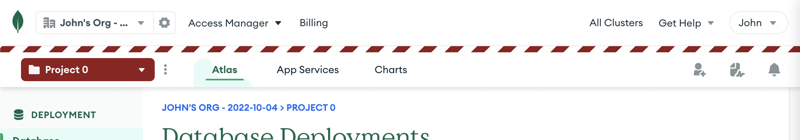

# userscript-mongo-atlas-visual-project-indicator

## Install
* [Install Violentmonkey](https://violentmonkey.github.io/get-it/) or any other userscript manager
* [Install this userscript](/mongo-atlas-visual-project-indicator.user.js?raw=1)
